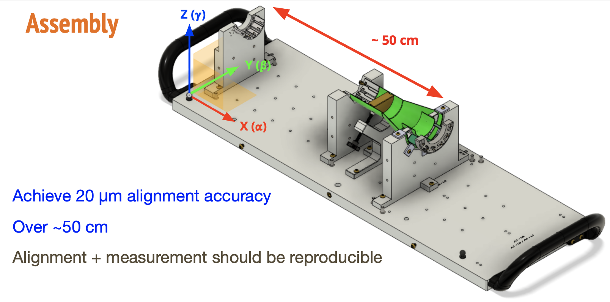

# MVTX assembly
An archive of the MVTX alignment and assembly procedure
## Check the [slides](https://docs.google.com/presentation/d/1Mw-gxMG6_pSEkKxFjsVr7o5ma_s3q36b/edit?usp=sharing&ouid=115313506692148889725&rtpof=true&sd=true)

## Quick start
It requires c++11.
Please modify the Makefile accordingly to your system.
Will include docker image in the future.

Here are some of the modules you may need to install
```
pip install seaborn 
pip install plotly
```
Then run
```
./summary.sh
```

This will read the CMM probe x,y,z data and fit the measurements to the multiple faces of the part in CAD model.
There are 12 parts: 3 layers (L0, L1, L2) X North and South End Wheel (NEW, SEW) X 2 parts each (_1, _2).
The output will give rotational values ($\alpha$, $\beta$, and $\gamma$: "a", "b", and "g") and translational values ($xt$, $yt$, and $zt$).

## TLDC (Too Long Don't Care) of the MVTX alignment
 
How will you achieve a 20 $\mu$m accuracy over 50 cm? There is no flat face perpendicular or parallel to the earth or fiducial markers measureable during the assembly process.

$\Rightarrow$ How do we determine the complete pose (position and orientation) of the detector parts? All you have is a Coordinate Measuring Machine with $\sim$ 2 micron precision.

 
The answer is multiple CMM probing of many faces the parts.
Then we perform a conjugate gradient minimization (see the [reference](https://scripts.iucr.org/cgi-bin/paper?S0567739482001806))
on the CMM points to the CAD model to find the translation and rotation value from the part position to the model "ideal" position.

## How to run
- Warning: You can modify this code to use but right now, this is very much MVTX alignment/assembly oriented. i.e. It works very quickly on the fly where you CMM-measure and use the data with its specific print format.
